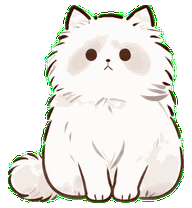
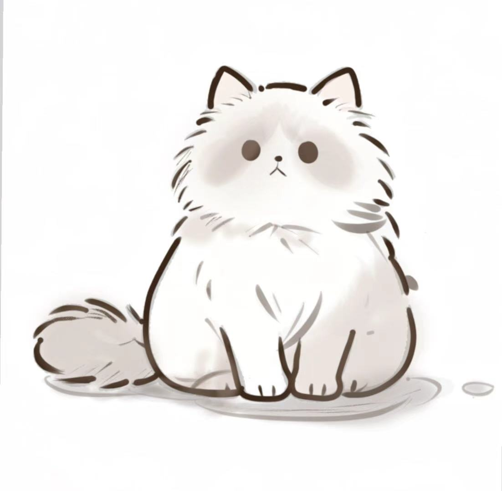
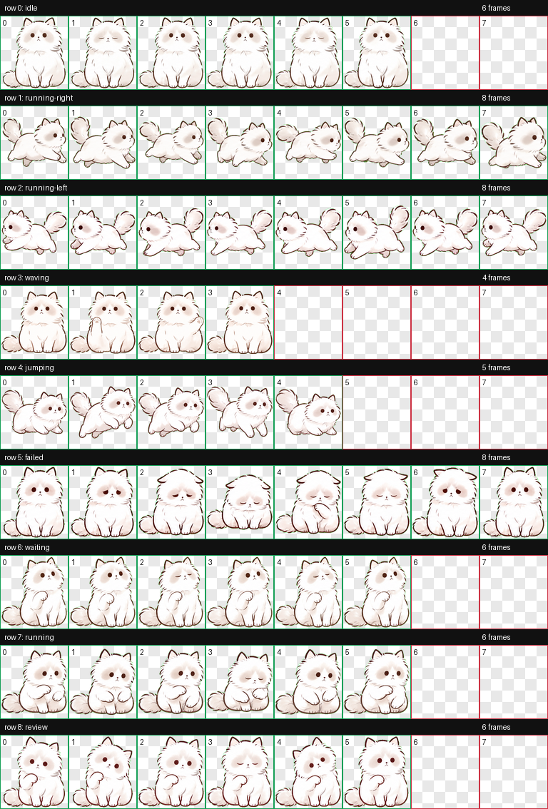
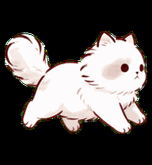
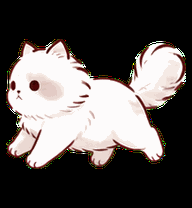

# 小猫总 / Xiao Mao Zong

<p align="center">
  <strong>中文默认展示</strong> · Each section has an <strong>English</strong> toggle
</p>

<p align="center">
  
</p>

小猫总是一个给 Codex 使用的自定义桌面宠物，基于一张私人手绘小猫原图制作。它是一只软乎乎的白色小猫，带淡棕色脸颊、黑豆眼和一点点认真委屈的小表情。

<details>
<summary>English</summary>

Xiao Mao Zong is a custom Codex desktop pet based on a private hand-drawn cat reference. It is a soft fluffy white kitten with warm taupe cheek patches, dot eyes, and a tiny thoughtful pout.

</details>

## 预览 / Preview

| 原图 | 动作表 |
| --- | --- |
|  |  |

<details>
<summary>English</summary>

| Original drawing | Animation sheet |
| --- | --- |
|  |  |

</details>

## 额外行走动作 / Extra Walking Action

Codex 当前宠物包使用固定的 9 行状态表，所以行走动作作为扩展资源单独放在仓库里，不会破坏 `codex-pet/` 的可安装结构。

| 向右走 | 向左走 |
| --- | --- |
|  |  |

<details>
<summary>English</summary>

Codex currently uses a fixed 9-row pet state sheet, so the walking action is provided as an extra repository asset. It does not change or break the installable `codex-pet/` package.

| Walk right | Walk left |
| --- | --- |
|  |  |

</details>

## 包内容 / Package Contents

- `codex-pet/pet.json`: Codex 宠物配置
- `codex-pet/spritesheet.webp`: 9 行动画 spritesheet
- `assets/original-drawing.jpg`: 原始参考图
- `assets/contact-sheet.png`: QA 动作总览
- `assets/previews/*.gif`: 单行动作预览
- `assets/walking/*`: 额外行走动作 strip 和源图
- `dist/xiaomaozong-codex-pet.zip`: 可直接下载的宠物包
- `dist/xiaomaozong-walking-assets.zip`: 额外行走动作资源包

<details>
<summary>English</summary>

- `codex-pet/pet.json`: Codex pet metadata
- `codex-pet/spritesheet.webp`: 9-row animation spritesheet
- `assets/original-drawing.jpg`: original reference image
- `assets/contact-sheet.png`: QA contact sheet
- `assets/previews/*.gif`: per-state animation previews
- `assets/walking/*`: extra walking strips and source image
- `dist/xiaomaozong-codex-pet.zip`: downloadable pet package
- `dist/xiaomaozong-walking-assets.zip`: extra walking action asset package

</details>

## 安装 / Install

1. 下载 `dist/xiaomaozong-codex-pet.zip`，或者直接使用 `codex-pet/` 目录里的两个文件。
2. 在本机创建目录：

```powershell
mkdir "$env:USERPROFILE\.codex\pets\xiaomian"
```

3. 把 `pet.json` 和 `spritesheet.webp` 放入：

```text
%USERPROFILE%\.codex\pets\xiaomian\
  pet.json
  spritesheet.webp
```

4. 重启或刷新 Codex 后，宠物显示名应为 **小猫总**。

<details>
<summary>English</summary>

1. Download `dist/xiaomaozong-codex-pet.zip`, or use the two files in `codex-pet/`.
2. Create the local Codex pet folder:

```powershell
mkdir "$env:USERPROFILE\.codex\pets\xiaomian"
```

3. Put `pet.json` and `spritesheet.webp` here:

```text
%USERPROFILE%\.codex\pets\xiaomian\
  pet.json
  spritesheet.webp
```

4. Restart or refresh Codex. The pet display name should be **小猫总**.

</details>

## 说明 / Notes

仓库 slug 使用 `xiaomaozong`，宠物内部 id 保持为 `xiaomian`，这样不会破坏已经安装好的 Codex 宠物路径。原图由仓库所有者提供，请尊重原作者和原图授权。

<details>
<summary>English</summary>

The repository slug is `xiaomaozong`, while the internal pet id remains `xiaomian` to preserve the existing Codex pet path. The original drawing was provided by the repository owner; please respect the original artist and permissions.

</details>
